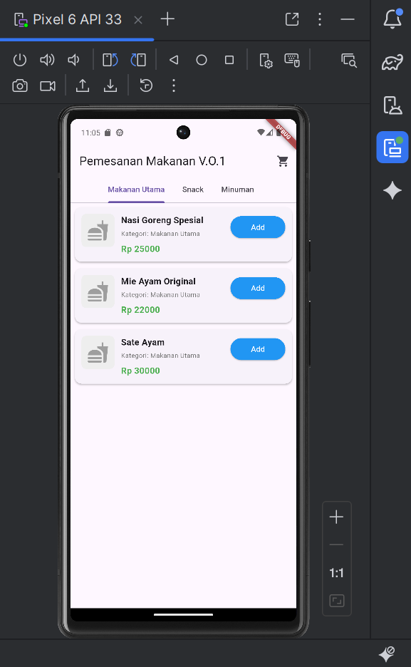
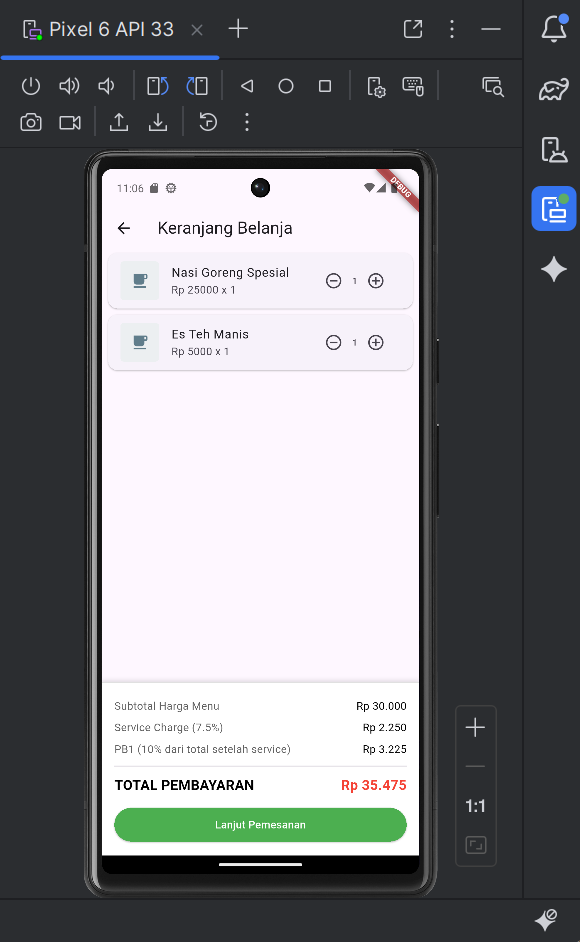

# Project Flutter Pemesanan Makanan (V.0.1)

Aplikasi ini adalah studi kasus Pemesanan Makanan berbasis Flutter yang dikembangkan sebagai tugas PBP. Aplikasi ini memungkinkan pengguna melihat daftar menu, menambah item ke keranjang belanja, dan melihat ringkasan pesanan.

## Tampilan Aplikasi (Screenshots)
### 1. Halaman Utama (Semua Menu)

### 2. Halaman Daftar Menu Makanan Snack

### 3. Halaman Daftar Menu Minuman

### 4. Halaman Keranjang Belanja

### notes:

- [Lab: Write your first Flutter app](https://docs.flutter.dev/get-started/codelab)
- [Cookbook: Useful Flutter samples](https://docs.flutter.dev/cookbook)

For help getting started with Flutter development, view the
[online documentation](https://docs.flutter.dev/), which offers tutorials,
samples, guidance on mobile development, and a full API reference.
